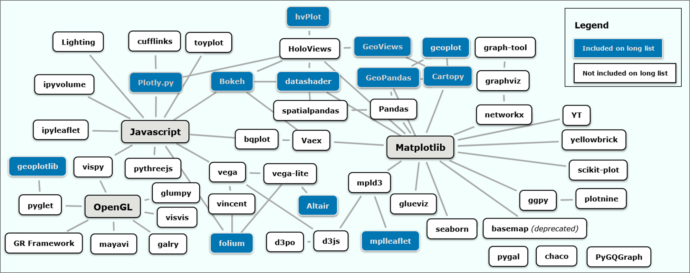
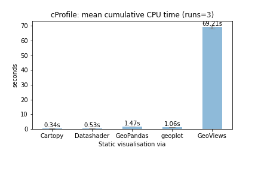
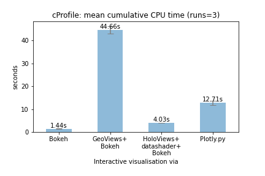
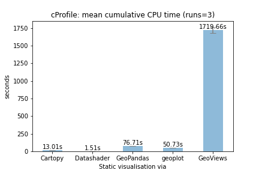
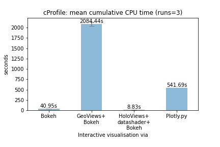
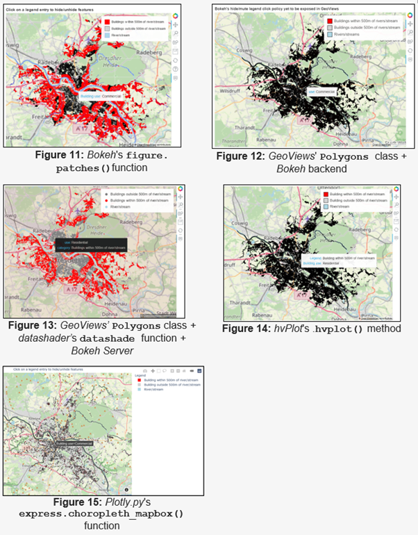

# mapcompare

  

Comparison of Python libraries for creating both static and interactive visualisations of large geospatial vector data (n=140,000+).

  

An MSc thesis at Ulster University.

  

## Which visualisation libraries are included in the comparison?

  

The figure below expands on [VanderPlas (2017)]( https://www.youtube.com/watch?v=FytuB8nFHPQ), highlighting long-listed packages or libraries with geospatial functionalities (find an interactive mind map of this figure [here]( https://www.mindomo.com/mindmap/d932a80b26bc4cc59d0729ccb6a01a2b)).

 

  

Provisionally short-listed libraries are indicated in **bold** below.

  
| **Static** | **Interactive** |
|--|--|
| (1) ***GeoPandas***, (2) ***cartopy***, (3) ***geoplot***, (4) ***datashader*** only, (5) ***GeoViews*** only, (6)* **GeoViews + datashader***, (7) ***Altair***. | (1) ***Bokeh***, (2) ***Plotly.py***, (3) ***Holoviews+datashader+Bokeh***, (4) ***Geoviews+Bokeh***, (5) ***Altair***, (6) *folium*, (7) *mplleaflet*, (8) *geoplotlib*. |

## How are libraries being compared?

  

A simple visualisation task is performed across both the static and interactive track, and secondly for both a full dataset and a smaller subset. The full dataset contains 144,727 polygons representing the city of Dresden's real-estate cadastre. The subset contains 2,645 polygons. Both databases are queried in PostGIS, returning three sets of results tables which are converted to *GeoPandas* GeoDataFrames to serve as inputs to the visualisation libraries. In some cases, these are converted to the respective supported data formats prior to the actual plotting task.

  

Short-listed libraries are then compared as follows:

  

1. Comparing a range of library metadatea including:

  

* Ease of installation (install via the _pip_ package installer, the _conda_ main channel or the _conda-forge_ community channel, or via _setup.py_);

  

* Input formats/required conversions;

  

* Output formats;

  

* Continuity of the developer community (_measures_: number of GitHub releases since first release, number of total commits; number of contributors; date of last commit; number of dependent packages and number of dependent repositories.

  

2. Reproducing a pre-defined map template as closely as possible;

  

3. Comparing the complexity of the syntax to reproduce the map template;

  

4. Comparing the time taken for only the rendering portion of a script to complete, i.e. excluding the data acquisition and, if required by any library, the data preparation portion, using *cProfile* .

  

7. Comparing the visual quality and functionality of the map products (conformity with the map template, responsiveness, interactive enhancements);

  

8. Any limitations and technical challenges encountered.

  

## Initial Results

### Subset dataset (feature count: 2,645)
  
|  **Static**  | **Interactive**  |
|--|--|
|  |    |

###  Full dataset (feature count: 144,727)

 
| **Static** | **Interactive** |
|--|--|
|   |   |
  

## Overview of initial outputs

 

### Static visualisations

  
### Interactive visualisations
  

