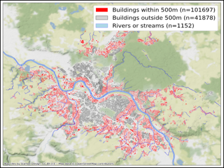
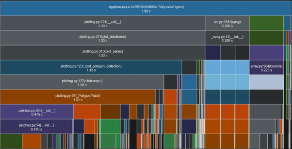
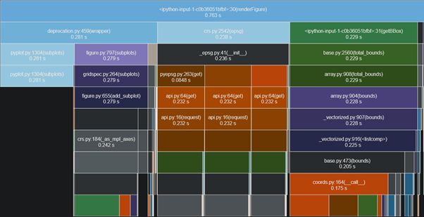
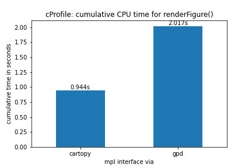

# pyviz-mapcompare
Comparison of Python libraries for creating non-interactive and interactive visualisations of large geospatial vector datasets (n=140,000+).

An MSc thesis at Ulster University.

## Which visualisation libraries are included in the comparison?

| **Non-interactive** | **Interactive** (provisional) | 
|--|--|
| Different *matplotlib* interfaces via (1) *GeoPandas*, (2) *cartopy*, and (3) *geoplot*. | (1) *Bokeh*, (2) *plotly/dash*, (3) *datashader/holoviews*, (4) *geoplotlib*, (5) *folium*, (6) *Altair* |

## How are libraries being compared?

A visualisation task common in urban development will be performed across both the non-interactive and interactive track. A 144,727 polygon dataset, located in two tables of a PostGIS database containing the city of Dresden's real-estate cadastre, is queried, returning three sets of results tables which are converted to GeoDataFrames to serve as inputs to the visualisation libraries. The figure below is a sample visualisation of the dataset using GeoPandas' **GeoDataFrame.plot()** method.

Short-listed libraries are then compared as follows:

 1. Comparing a range of library metadatea including:
	 * Ease of installation (install via the _pip_ package installer, the _conda_ main channel or the _conda-forge_ community channel, or via _setup.py_);
	  * Input formats (e.g. GeoDataFrames, from disk via .shp or .geojson);
	  * Output formats;
	  * Continuity of the developer community (_measures_: number of GitHub releases since first release, number of total commits; date of last commit; number of dependent packages and number of dependent repositories (‘repos’)_,_ as a measure of the library’s centrality and popularity in the Python visualisation ecosystem (both geospatial and otherwise);
 2. Reproducing a pre-defined map template as closely as possible using the
            capabilities of all short-listed libraries;
 3. Comparing the complexity of the syntax to reproduce the map
        template;
 4. Comparing the time taken for only the rendering portion of a script to
        complete, i.e. excluding the data acquisition and, if required by
        any library, the data formatting portion, using *cProfile* and *_snakeviz_* to visualise results as ‘icicle’ graphs such as the below, which compares two different *matplotlib* interfaces: *GeoPandas'* **GeoDataFrame.plot()** method (left) and *cartopy*'s **GeoAxes.add_geometries()** method (right).
        
|  |  |
|--|--|

 
  7. Comparing the visual quality and functionality of the map products
    (resolution, conformity with the map template, responsiveness, interactive enhancements);
    
 8. Any limitations and technical challenges encountered.