> A comparison of Python libraries for static and interactive visualisations of large vector data.

- [Which libraries are being compared?](#which-libraries-are-being-compared)
- [How are libraries being compared?](#how-are-libraries-being-compared)
- [Results](#results)
  - [Code complexity](#code-complexity)
  - [CPU runtime](#cpu-runtime)
    - [Subset dataset (feature count: 2,645)](#subset-dataset-feature-count-2645)
    - [Complete dataset (feature count: 144,727)](#complete-dataset-feature-count-144727)
- [Output samples](#output-samples)
  - [Static visualisations](#static-visualisations)
  - [Interactive visualisations](#interactive-visualisations)
- [Study limitations](#study-limitations)

## Which libraries are being compared?

The figure below expands on [VanderPlas (2017)]( https://www.youtube.com/watch?v=FytuB8nFHPQ), highlighting long-listed packages or libraries with geospatial functionalities (find an interactive mind map of this figure to view or to copy and edit [here]( https://www.mindomo.com/mindmap/d932a80b26bc4cc59d0729ccb6a01a2b)).

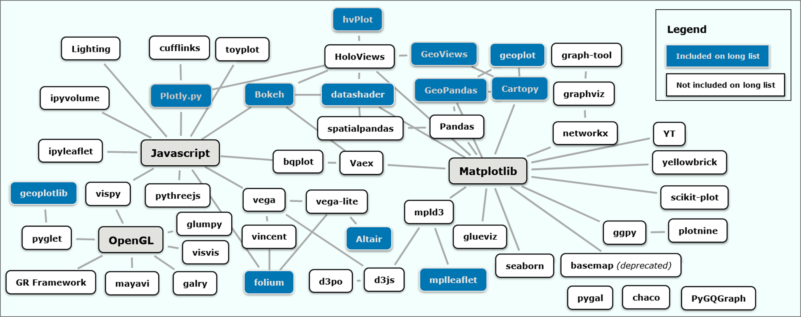

The table below summarises the long-list and indicates short-listed libraries in **bold**.

| **Static** | **Interactive** |
|--|--|
| (1) ***GeoPandas***, (2) ***cartopy***, (3) ***geoplot***, (4) ***datashader*** (for illustration only), (5) *GeoViews* + *mpl* (apparently no legend support yet), (6) ***Altair*** (no basemap support yet). | (1) ***Bokeh***, (2) ***Plotly.py***, (3) ***GeoViews+Bokeh***, (4) ***GeoViews+datashader+Bokeh***, (5) ***hvPlot+GeoViews+Bokeh***, (6) *Altair* (no *Vega-Lite* support for interactivity with geoshapes yet), (7) *folium*, (8) *mplleaflet*, (9) *geoplotlib*. |

## How are libraries being compared?

A simple visualisation task was performed across both the static and interactive track, and secondly for both a complete dataset and a smaller subset. The complete dataset contained 144,727 polygons representing the city of Dresden's real-estate cadastre. The subset contained 2,645 polygons from the same dataset. Both databases were queried in PostGIS via *GeoPandas*' `from_postgis()` function, returning three *GeoPandas* GeoDataFrames to directly or indirectly serve as primary data inputs (more on data acquisition and preparation can be found [here](data/README.md)).

Long-listed libraries were first compared by compiling a range of metadata:

1.	Output formats;
2.	general implementation strategy;
3.	Installation channels and requirements;
4.	Input formats and required data conversions;
5.	Proxies suggesting the vibrancy of the developer and user community.

The short list tried to include both large-community projects (e.g., *Bokeh* and *Plotly*) as well as libraries relying on a more limited number of contributors (e.g., *geoplot*). All short-listed libraries needed to show on-going development in the last year (hence the exclusion of *mplleaflet* and *geoplotlib*) and needed to be able to plot geometries without employing a Web Tile Service (hence the exclusion of *folium*). A variety of backends and both imperative and declarative approaches are included. Finally, *datashader* was included in the static track ‘out of competition’, to first demonstrate its ‘as-is’ functionality before employing it in the interactive track in conjunction with a core plotting library.

The short-listed libraries were then compared along these indicators:

1.	the range of available documentation, based on common documentation ‘elements’ and code examples consulted to implement the task;

2.	the number of lines of code needed to reproduce the map template, excluding comments and blank lines. This provided a proxy measure for code complexity, using a ‘reduced’ version of the more feature-rich extended scripts. The reduced versions do not wrap rendering-related assignment statement in a function (the `renderFigure()` function of the extended scripts) and exclude optional user inputs. To improve code legibility and comparability, the same level of intermediate assignment statements across libraries were used;

3.	the ability to reproduce the map template including a legend and basemap;

4.	resource requirements (output file size and, for interactive visualisations, a subjective assessment of ‘responsiveness’ on pan and zoom);

5.	the cumulative CPU runtime required for the Python-based portion of the main `renderFigure()` function to complete, indicated as an average across a total of 10 runs. To increase comparability, the rendering function excluded both data acquisition and any data pre-processing, reprojection or conversion steps. CPU runtimes were measured using the *cProfile* module before writing the results of individual runs to labelled *cProfile* output files in the binary `.prof` format for analysis. As rendering is ultimately performed by the execution of JavaScript code, *cProfile* will not capture the entirety of the processing costs for the interactive track. The following measures were taken to ensure comparability of results:
    *	The Python kernel was restarted before each new benchmarking session;
    *	To prevent some libraries, such as *Cartopy*, from re-using an already drawn canvas, each run was executed manually rather than as part of a `for` loop (with the exception of the ‘out of competition’ runs of *datashader*), even though labelling of the `.prof` files was automated through a `for` loop;
    *	During performance measurement, no basemap tiles were added (`basemap=False`) and figures were not written to disk (`savefig=False`);
    *	To account for some libraries’ lazy execution of underlying rendering functions, force rendering within the interactive interpreter window during the course of the function call, or prevent libraries from displaying the figure in a browser window by default, the adjustments outlined in the table below were added to respective scripts depending on libraries’ default behaviour, or their particular behaviour if central calls to, say, a `plot` or `chart` object are made within a Jupyter Notebook or the VSCode Python Extension as part of a function call:

| **Static** | **Adjustment** |  **Interactive**  | **Adjustment**  |
|:-|:-|:-|:-|
|*GeoPandas + Matplotlib*|`fig.canvas.draw()` (pro-forma only, no effect on behaviour or performance)|*Bokeh*|`bokeh.io.output.output_notebook()` … `bokeh.io.show(plot)`|
|*Cartopy + Matplotlib*|`fig.canvas.draw()`|GeoViews + Bokeh*|`bokeh.plotting.show(gv.render(plot))`|
|*geoplot + Matplotlib* |`matplotlib.pyplot.gcf()`|*GeoViews+ datashader + Bokeh Server*|*None*|
|*Altair + Vega-Lite*|`altair.renderers.enable('mimetype')` ...  `IPython.display.display(chart)`|*hvPlot + GeoViews + Bokeh*|`IPython.display.display(plot)`|
|*datashader*|*None*|*Plotly*|*None*|

## Results

The more qualitative results regarding documentation are not reproduced here.

### Code complexity

Excluding blank lines and comments, and assessing the 'reduced code' versions in `scripts/min_code/` which reproduce the map template including a categorical legend and a tiled basemap, where possible.

|  **Static**  | **Interactive**  |
|--|--|
| 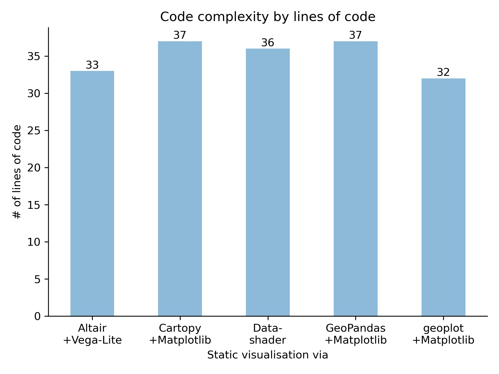 |  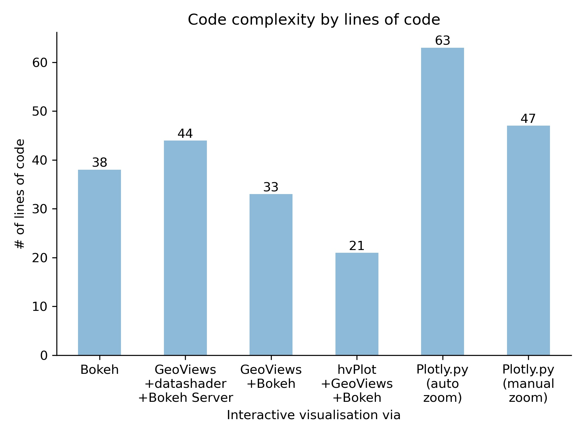  |

### CPU runtime

#### Subset dataset (feature count: 2,645)

|  **Static**  | **Interactive**  |
|--|--|
| 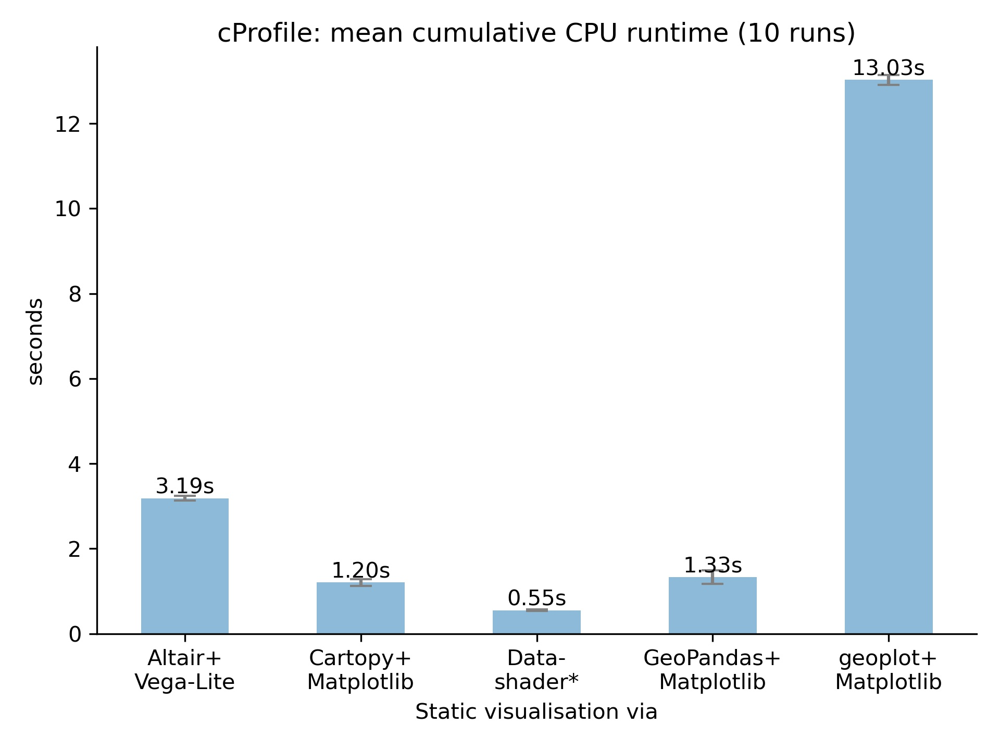 |  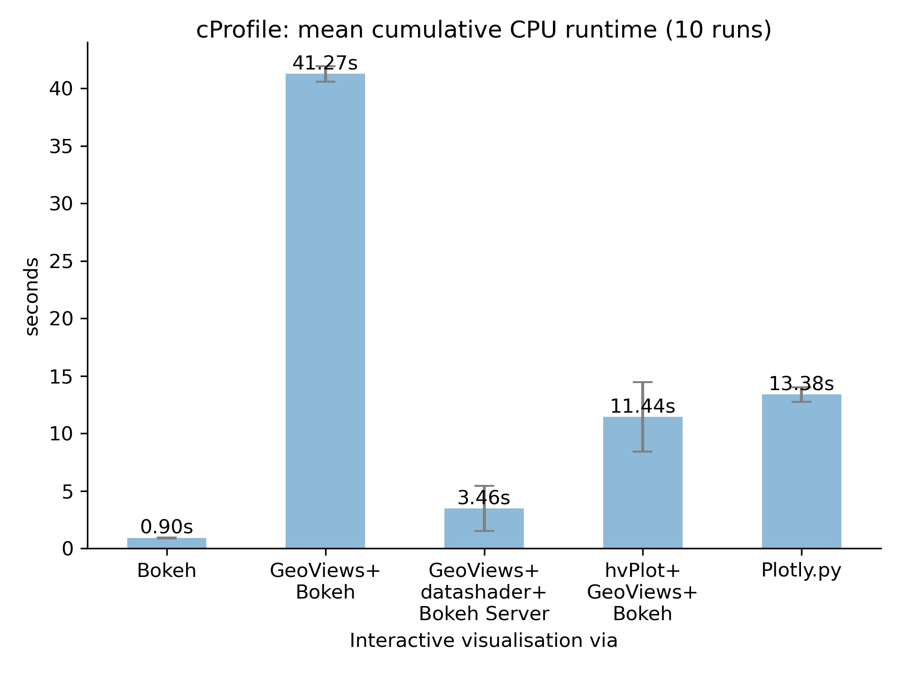  |

####  Complete dataset (feature count: 144,727)

| **Static** | **Interactive** |
|--|--|
| 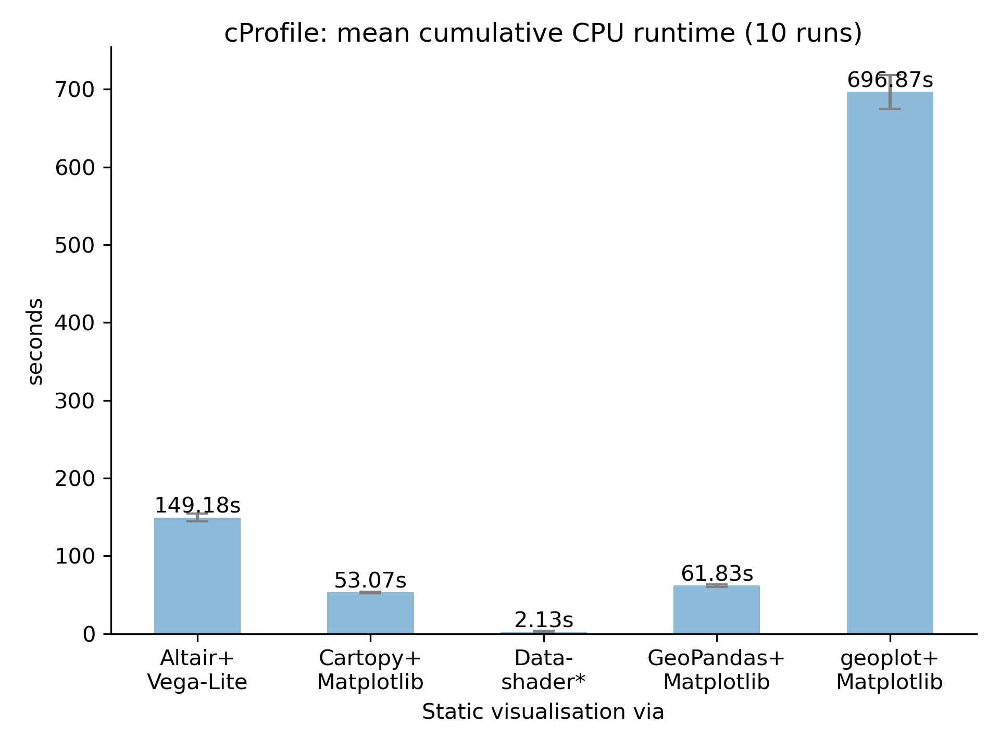  |  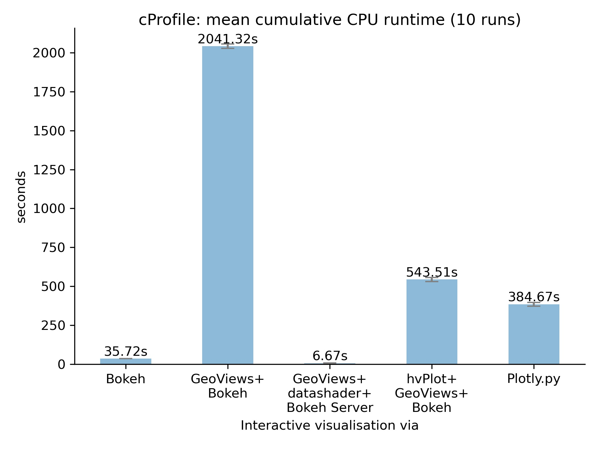 |

## Output samples

### Static visualisations

(A) *GeoPandas*’ `GeoDataFrame.plot()` method, (B) *Cartopy*'s `add_geometries()` function, (C) *Geoplot*'s `polyplot()` function, (D) *Altair*’s `Chart` class, (E) *Datashader*'s `transfer_functions.shade()` function

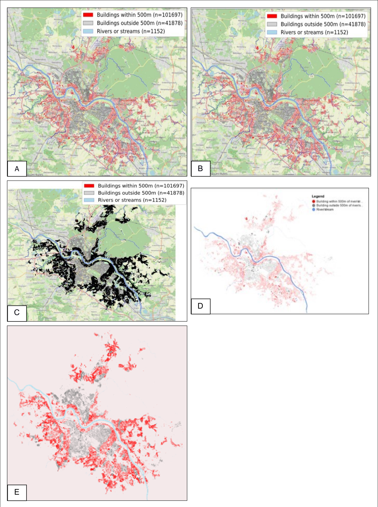

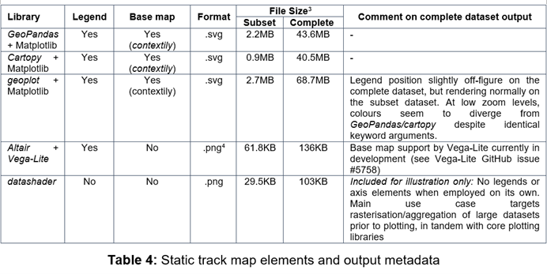

### Interactive visualisations

(A) *Bokeh*'s `figure.patches()` function, (B) *GeoViews*' `Polygons` class + *Bokeh* backend, (C) *GeoViews’* `Polygons` class + *datashader*’s `datashade` function + *Bokeh Server*, (D) *hvPlot*'s `hvplot()` method, (E) *Plotly.py*'s `express.choropleth_mapbox()` function

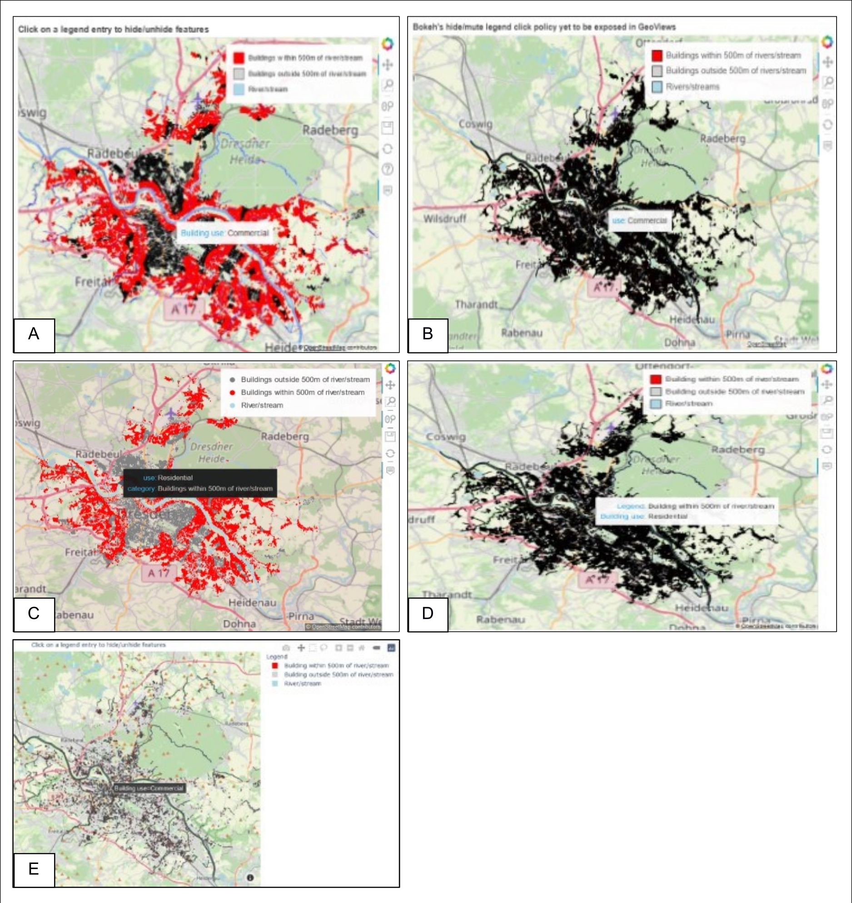

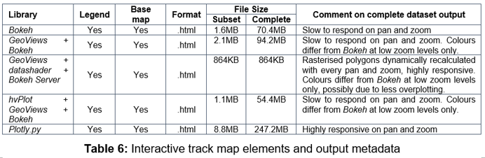

## Study limitations

Limitations for two of the chosen indicators should be highlighted here. Employing any of the short-listed libraries involves multiple complex technologies, some of which exist outside the Python ecosystem (e.g., Jupyter Notebook or the JavaScript libraries underlying both *Bokeh* and *Plotly.py*). Due to these confounding variables, the various adjustments outlined above are unlikely to have established a truly level playing field with regard to comparing CPU runtimes. What the *cProfile* results seek to demonstrate is a relative comparison of the user experience and the approximate time required to generate a map product on screen.

Due to the subjectivity of lines of code as a measure for code complexity, an alternative methodology could see groups of experts for each implementation develop a ‘best practice’ code sample, though this may further reduce comparability.

It must also be acknowledged that the static map products would not be considered useful outputs in most real-world scenarios: due to significant overplotting, a building-level analysis would rarely be presented at such a small representative fraction. Additionally, when converting figures to SVG on the static track, the large file sizes using the complete dataset would cause most viewing applications to become unresponsive. The same is true for saving to HTML on the interactive track. Except for live server-side aggregation and rasterisation as demonstrated by the *GeoViews* + *datashader* + *Bokeh Server* implementation, most workflows targeting web-based distribution would involve prior conversion to a series of map tiles to then be served by client-side Web Tile Services.

Similarly, the simplicity of the chosen visualisation task also meant that more advanced, and for local authorities potentially more interesting, use cases such as dashboarding were not demonstrated. Both *Bokeh*’s and *Plotly*’s native dashboarding capabilities as well as HoloViz’s *Panel* library are therefore mentioned here.

Finally, due to the interconnectedness of the Python ecosystem, a library’s functionalities and performance cannot be solely attributed to its own codebase. All libraries as well as their dependencies are under constant development. As such, the state of play outlined here represents merely a snapshot.