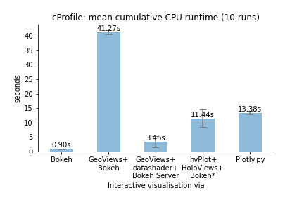
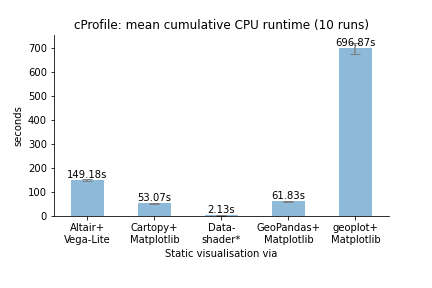
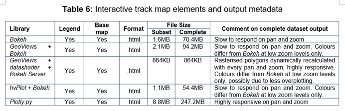

# mapcompare

  

Comparison of Python libraries for creating both static and interactive visualisations of large geospatial vector data (n=140,000+).

  

An MSc thesis at Ulster University (on-going).

  

## Which visualisation libraries are included in the comparison?

  

The figure below expands on [VanderPlas (2017)]( https://www.youtube.com/watch?v=FytuB8nFHPQ), highlighting long-listed packages or libraries with geospatial functionalities (find an interactive mind map of this figure to view or to copy and edit [here]( https://www.mindomo.com/mindmap/d932a80b26bc4cc59d0729ccb6a01a2b)).

 

  

The table below summarises the long-list and indicates short-listed libraries in **bold**.

  
| **Static** | **Interactive** |
|--|--|
| (1) ***GeoPandas***, (2) ***cartopy***, (3) ***geoplot***, (4) ***datashader*** (for illustration only), (5) *GeoViews* + *mpl* (apparently no legend support yet), (6) ***Altair*** (no basemap support yet). | (1) ***Bokeh***, (2) ***Plotly.py***, (3) ***GeoViews+Bokeh***, (4) ***GeoViews+datashader+Bokeh***, (5) ***hvPlot+Bokeh***, (6) *Altair* (no *Vega-Lite* support for interactivity with geoshapes yet), (7) *folium*, (8) *mplleaflet*, (9) *geoplotlib*. |

## How are libraries being compared?

  

A simple visualisation task is performed across both the static and interactive track, and secondly for both the complete dataset and a smaller subset. The complete dataset contains 144,727 polygons representing the city of Dresden's real-estate cadastre. The subset contains 2,645 polygons. Both databases are queried in PostGIS, returning three sets of results tables which are converted to *GeoPandas* GeoDataFrames to serve as inputs to the visualisation libraries. In some cases, these are converted to the respective supported data formats prior to the actual plotting task.

  

Long-listed libraries are first compared by compiling a range of metadata:

  * General implementation strategy (e.g. a high-level interface to a third-party ‘core’ plotting library or a core library itself);

  * Installation channels and requirements;

  

  * Input formats/required conversions;

  * Output formats (static images, interactive maps. or both);;

  * Proxies measuring the vibrancy of the developer and user community  (_measures_: number of GitHub releases since first release, number of total commits; number of contributors; date of last commit; number of dependent packages and number of dependent repositories.

The short-list then tried to include both large-community, comparatively well-funded projects (such as *Bokeh* and *Plotly*) as well as libraries relying on a more limited number of contributors (such as *geoplot*). It was also attempted to cover a variety of backends and both imperative as well as declarative approaches. 

The short-listed libraries were then compared along these indicators:

1.	the quality of documentation based on a element-wise juxtaposition of documentation ‘elements’ and a sample of applicable code examples consulted to implement the common visualisation task;

2.	the complexity of the syntax as measured by the total number of lines of code of a ‘reduced code’ version required to reproduce the map template, excluding comments and blank lines;

3.	the ability to reproduce the map template including map elements such as a legend and basemap;

4.	resource requirements (output file size and, for interactive visualisations, a subjective assessment of ‘responsiveness’ on pan and zoom);

5.	the time taken for the rendering portion of a script to complete, indicated as an average across a total of N runs: The rendering portion excludes data acquisition and, if required by any library, data pre-processing and conversion. CPU times were measured using the *cProfile* module after a kernel restart to prevent caching from prior runs skewing the measurement. During performance measurement, no basemap tiles were added to also not skew results due to tile fetching.

6.	Any other limitations or challenges encountered.

## Initial Results

### Code complexity

Excluding blank lines and comments, and assessing the 'reduced code' versions in `scripts/min_code/` which reproduce the map template including a categorical legend and a tiled basemap, where possible.

|  **Static**  | **Interactive**  |
|--|--|
|  |    |

### CPU runtime

#### Subset dataset (feature count: 2,645)
  
|  **Static**  | **Interactive**  |
|--|--|
|  |    |

####  Complete dataset (feature count: 144,727)

 
| **Static** | **Interactive** |
|--|--|
|   |   |
  

## Overview of initial outputs (complete dataset)

 

### Static visualisations

### Interactive visualisations
  

