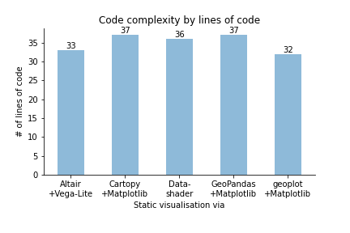
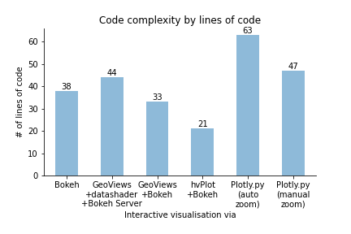
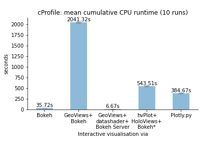
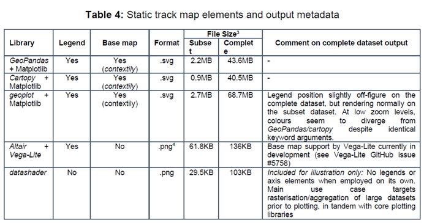

> A comparison of Python libraries for static and interactive visualisations of large vector data. 
> An MSc thesis at Ulster University (on-going).

- [Which libraries are being compared?](#which-libraries-are-being-compared)
- [How are libraries being compared?](#how-are-libraries-being-compared)
- [Results](#results)
  - [Code complexity](#code-complexity)
  - [CPU runtime](#cpu-runtime)
    - [Subset dataset (feature count: 2,645)](#subset-dataset-feature-count-2645)
    - [Complete dataset (feature count: 144,727)](#complete-dataset-feature-count-144727)
- [Output samples](#output-samples)
  - [Static visualisations](#static-visualisations)
  - [Interactive visualisations](#interactive-visualisations)
- [Study limitations](#study-limitations)

  

## Which libraries are being compared?

  

The figure below expands on [VanderPlas (2017)]( https://www.youtube.com/watch?v=FytuB8nFHPQ), highlighting long-listed packages or libraries with geospatial functionalities (find an interactive mind map of this figure to view or to copy and edit [here]( https://www.mindomo.com/mindmap/d932a80b26bc4cc59d0729ccb6a01a2b)).

 

  

The table below summarises the long-list and indicates short-listed libraries in **bold**.

  
| **Static** | **Interactive** |
|--|--|
| (1) ***GeoPandas***, (2) ***cartopy***, (3) ***geoplot***, (4) ***datashader*** (for illustration only), (5) *GeoViews* + *mpl* (apparently no legend support yet), (6) ***Altair*** (no basemap support yet). | (1) ***Bokeh***, (2) ***Plotly.py***, (3) ***GeoViews+Bokeh***, (4) ***GeoViews+datashader+Bokeh***, (5) ***hvPlot+Bokeh***, (6) *Altair* (no *Vega-Lite* support for interactivity with geoshapes yet), (7) *folium*, (8) *mplleaflet*, (9) *geoplotlib*. |

## How are libraries being compared?

  

A simple visualisation task is performed across both the static and interactive track, and secondly for both a complete dataset and a smaller subset. The complete dataset contains 144,727 polygons representing the city of Dresden's real-estate cadastre. The subset contains 2,645 polygons from the same dataset. Both databases are queried in PostGIS via *GeoPandas*' `from_postgis()` function, returning three *GeoPandas* GeoDataFrames to directly or indirectly serve as primary data inputs (more on data acquisition and preparation can be found [here](data/README.md)).

Long-listed libraries are first compared by compiling a range of metadata:

  * General implementation strategy (e.g. a high-level interface to a third-party ‘core’ plotting library or a core library itself);

  * Installation channels and requirements;

  

  * Input formats/required conversions;

  * Output formats (static images, interactive maps. or both);;

  * Proxies measuring the vibrancy of the developer and user community  (_measures_: number of GitHub releases since first release, number of total commits; number of contributors; date of last commit; number of dependent packages and number of dependent repositories).

The short-list then tried to include both large-community, comparatively well-funded projects (such as *Bokeh* and *Plotly*) as well as libraries relying on a more limited number of contributors (such as *geoplot*). It was also attempted to cover a variety of backends and both imperative as well as declarative approaches. 

The short-listed libraries were then compared along these indicators:

1.	the range of documentation based on a juxtaposition of documentation ‘elements’ and a sample of applicable code examples consulted to implement the common visualisation task;

2.	the complexity of the syntax as measured by the total number of lines of code of a ‘reduced code’ version required to reproduce the map template, excluding comments and blank lines;

3.	the ability to reproduce the map template including map elements such as a categorical legend and basemap;

4.	resource requirements (output file size and, for interactive visualisations, a subjective assessment of ‘responsiveness’ on pan and zoom);

5.	5.	the cumulative CPU runtime required for the Python-based portion of the rendering function to complete, indicated as an average across a total of 10 runs: The rendering portion excludes data acquisition and, if required by any library, data pre-processing, reprojection or conversion. CPU times were measured using the *cProfile* module before writing the results of individual runs to labelled `.prof` files for later extraction and analysis. For the interactive track, as rendering is ultimately performed by the execution of *JavaScript* code, *cProfile* will not capture the entirety of the processing costs. The following measures were taken to ensure comparability of results:
    *	The Python kernel was restarted before each new benchmarking session;
    *	To prevent some libraries, such as *Cartopy*, from re-using an already drawn canvas, each run was executed manually rather than as part of a `for` loop (with the exception of the ‘out of competition’ runs of *datashader*), even though labelling of the `.prof` files was automated through a `for` loop;
    *	During performance measurement, no basemap tiles were added (`basemap=False` and figures were not written to disk (`savefig=False`);
    *	To account for some libraries’ lazy execution of underlying rendering functions, force rendering within the interactive interpreter window during the course of the function call, or prevent libraries from displaying the figure in a browser window by default, the adjustments outlined in the table below were added to respective scripts depending on libraries’ default behaviour, or their particular behaviour if central calls to, say, a `plot` or `chart` object are made within a Jupyter Notebook or the VSCode Python Extension as part of a function call:
  
| **Static** | **Adjustment** |  **Interactive**  | **Adjustment**  |
|:-|:-|:-|:-|
|*GeoPandas + Matplotlib*|`fig.canvas.draw()` (pro-forma only, no effect on behaviour or performance)|*Bokeh*|`bokeh.io.output.output_notebook()` … `bokeh.io.show(plot)`|
|*Cartopy + Matplotlib*|`fig.canvas.draw()`|GeoViews + Bokeh*|`bokeh.plotting.show(gv.render(plot))`|
|*geoplot + Matplotlib* |`matplotlib.pyplot.gcf()`|*GeoViews+ datashader + Bokeh Server*|*None*|
|*Altair + Vega-Lite*|`altair.renderers.enable('mimetype')` ...  `IPython.display.display(chart)`|*hvPlot + HoloViews + Bokeh*|`IPython.display.display(plot)`|
|*datashader*|*None*|*Plotly*|*None*|

## Results

The more qualitative results regarding documentation are not reproduced here.

### Code complexity

Excluding blank lines and comments, and assessing the 'reduced code' versions in `scripts/min_code/` which reproduce the map template including a categorical legend and a tiled basemap, where possible.

|  **Static**  | **Interactive**  |
|--|--|
|  |    |

### CPU runtime

#### Subset dataset (feature count: 2,645)
  
|  **Static**  | **Interactive**  |
|--|--|
|  |    |

####  Complete dataset (feature count: 144,727)

 
| **Static** | **Interactive** |
|--|--|
|   |   |
  

## Output samples

 

### Static visualisations

### Interactive visualisations
  

## Study limitations

Limitations for two of the chosen indicators should be highlighted here along with possible improvements. Employing any of the short-listed libraries involves multiple complex technologies, some of which outside the Python ecosystem (e.g. the Jupyter Notebook or the JavaScript libraries underlying both *Bokeh* and *Plotly.py*). Due to these confounding variables, the various usage adjustments are unlikely to have established a truly level playing field with regards to comparing **CPU runtimes**. What the *cProfile* results seek to demonstrate instead is a *relative* comparison of the user experience and the approximate time required to generate a map product on screen. Subsequent research should establish separate and more granular performance measures, for instance, one for the Python-based and one for the JavaScript-based portions of the process chain.

Due to the subjectivity of lines of code as a measure for **code complexity**, an improved methodology could see groups of experts for each implementation develop a ‘best practice’ code sample. Alternatively, the average across multiple unfiltered code samples received through a public call for submissions could be compared.

It must also be acknowledged that the static map products especially would not be considered useful outputs in most real-world scenarios: due to significant overplotting, a building-level analysis would rarely be presented at such a small representative fraction. In addition, when converting figures to SVG on the static track, the large file sizes using the complete dataset would cause most viewing applications to become unresponsive. The same is true for saving to HTML on the interactive track. Except for live server-side aggregation and rasterisation as demonstrated by the *GeoViews + datashader + Bokeh Server* implementation, most workflows targeting web-based distribution would involve prior conversion to a series of map tiles to then be served by client-side Web Tile Services.

Similarly, the simplicity of the chosen visualisation task also meant that more advanced, and for local authorities potentially more interesting, use cases such as dashboarding could not be demonstrated. Both *Bokeh*’s and *Plotly*’s native dashboarding capabilities as well as *HoloViz*’s Panel library shall therefore be mentioned.

Finally, due to the interconnectedness of the Python ecosystem, library functionalities and performance benchmarks cannot be solely attributed to its own codebase. All libraries as well as their dependencies are under constant development, with bottlenecks continuously being addressed and new features being added. As such, the state of play outlined here is merely a momentary snapshot.
